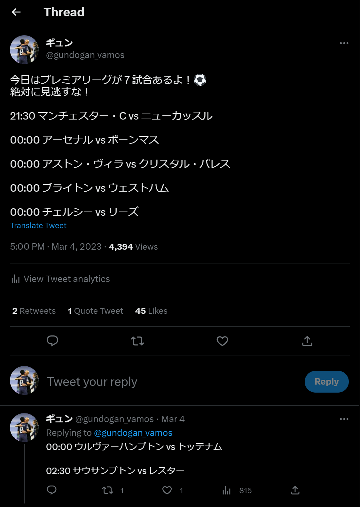

# FotBot
欧州サッカー情報を配信するTwitter botです

## code/matchday
- プレミアリーグ(EPL)の試合日程と対戦相手をTwitter botで配信します
- 試合日時　ホームチーム vs アウェーチーム
- 本番用リソースはAWS lambdaで管理しています
- 毎日17:00に作動します
- 延期された試合・終了した試合は通知されません
- [link](https://twitter.com/gundogan_vamos/status/1631927541996081153?s=46&t=BowfmUcWj0TK6I1rA1lSHQ)



# 起動
```
jupyter-notebook
```

# 参考
https://note.nkmk.me/pandas/

https://zenn.dev/motokoike/books/ef28866a3835cf/viewer/chapters6